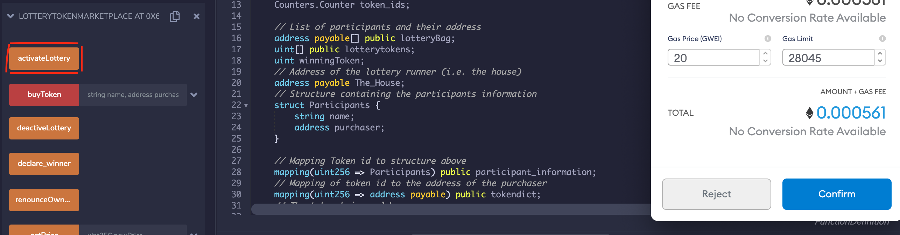

# Blockchain_Lottery

## BACKGROUND 

Lotteries have sufficed as a way for the government to generate revenue and act as a symbol of hope for miraculous wealth, but block-chain integrated lotteries would be an overall superior experience. Most physical things have proven to be more efficient and secure when digitized, such as wallets, and the lottery is yet another example of this ongoing trend. Although online lotteries do exist, leveraging blockchain in lotteries side steps potential downfalls of the physical lottery even more so than typical online lotteries.

Some issues with huge name lotteries such as Mega Millions or Powerball are that there have been multiple instances of inside jobs somehow manipulating the winning numbers or dates.  
Another lies in the overall cost of maintaining these “brick-and-mortar” lottery machines, so to speak.  There are staffing costs associated with maintaining the servers, maintaining the tickets, packaging, and distribution, commission to be paid to gas stations where tickets are sold, the television draws/radios/online ads that must be held to announce winning numbers, as well as create and promote new games.  Another significant drawback to physical lotteries is that some states do not allow winners to conceal their identities.  However, large winnings can put a huge target on a person’s back by friends, family, or even strangers that previously did not have any relationship with this person.  For states Arizona, Delaware, Georgia, Kansas, Maryland, Michigan, Texas, North Dakota, and Ohio, lottery winners are allowed to conceal their identities if their winnings exceed a certain dollar amount, according to the National Conference of State Legislatures.  

The blockchain framework improves the overall product of “a lottery” by a considerable amount. Trust and fairness is a crucial aspect of any game. Why would anyone participate in a game that wasn’t fair? Since all of the information is stored in “blocks” and collectively verified, the lottery can never lose its integrity or be manipulated. Also, making the lottery tickets completely digital and non-fungible eliminates the possibility of forging a winning ticket, which has become a common threat to traditional lotteries. The blockchain network inherently establishes a meritocracy that prompts users to abide by it. The payment methods become more efficient as well, for everything is conducted through virtual wallets and tokens. Although oversized checks are a staple of lotteries, digital payments are more efficient in nature. Additionally, the adaptability of the contracts allows for more creativity when structuring the lottery system which will be covered more in depth later on in this analysis.     

____

## CONTRACT DESCRIPTIONS

### ERC721 - Why did we use NFT as opposed to fungible?
We used an NFT so every player that buys into the lottery will have a unique token. This will help eliminate fraud and multiple winning tokens so there can only be one winner. 

### Activate and Deactivate functions:
The activateLottery function makes sure that no unauthorized users can start the lottery and only “the house” can start a new session in the same way that the deactivateLottery function makes sure only “the house” can end the lottery and declare a winner. This proves as a safeguard against hackers messing with the timing of the lottery contract. 

### Selecting random winner and distributing funds:
Our contract not only accounts for making sure “the house” is the only authorized user to pick a winner and validate that more than the necessary 1 player is logged, but also selects a random token from the list of active lottery players to make sure that there is a winner in every round. The funds are then directly transferred to the player’s wallet who owns the selected token. It completely blocks any possibility of a fraudulent transaction or claim to the winning number. 

### getWinner function:
We used a getWinner function to immediately show us both the winner’s name and token address so we can have a record of who won and the winner will be notified when the winnings are transferred to their account. 

____

## DEPLOYMENT DEMONSTRATION & INSTRUCTIONS

After the code has been written, we can proceed with the deployment and running of the lottery. 

1) First, we will compile and deploy the LotteryToken.sol solidity file. This will set up our actual token using the ERC721 standard. When the MetaMask notification pops up, please hit 'Confirm' to continue. 

2) Next, we can deploy the LotteryTokenMarket.sol solidity file. This file and contract will allow wallet address to enter our contract unsolicited and purchase our NFT tokens in order to be apart of the lottery. 

To deploy, you will have to provide a price for the NFTs and a token address. For a token address, please copy the address from the previously deployed LotteryToken contract. Again, when the MetaMask notification appears, select 'Confirm' to continue.

3) Once we have deployed both contracts, we will want to activate the lottery through the LotteryTokenMarket contract. In our code, we have create a boolean to declare whether or not the lottery is active. In order for participants to purchase tokens, we will need to activate the lottery.

4) Once the lottery has been activate, participants will be allowed to begin purchasing their tokens. When they purchase, they will have to enter their wallet address and their names. These attributes will be added to *struct* and *mapping* objects so that we can keep track of the participant's information and declare a winner at the end. 

In this demonstration, I will be using two address from my Ganache and will name them 'Bill' and 'Carl'. In order to purchase, you will need to insert 1 in the value field above the deployed contracts

5) After our participants have purchased their tokens, which will serve as their lottery tickets, there are some things we can do to verify that our contract is working correctly. First, we can select **get_pot_balance** in the LotteryTokenMarket contract to ensure that the balance of the contract has gone up in relation to the purchases of tokens (should be 2). Secondly, select **participant_information** and feed in either 1 or 2 to make sure that we are properly keeping track of the participants and their address. Third, we can do the same with the **tokendict** object, as we will be using this mapping to award the balance to the winner. 

We can do a similar exercise in the LotteryToken contract. By call the **totalSupply** option, we can verify that the supply has increased from 0 to 2. We can also feed in our tokenIds (1, 2, 3, 4...) to the **owner** field to return the address that owns that particular token. 

6) After we have verified that we believe the contracts are working properly in relation to our transactions, we can deactivate our lottery. This will close our lottery, forbid any further purchases, and allow us to proceed with selecting a winner. The deactivate functionality is located in the LotteryTokenMarket contract.

7) With the lottery shutdown, we can select a winner. We can do so by selecting the **declare_winner** button in the LotteryTokenMarket contract. In the code, this will select a random, using the number of index in the lotteryTokens list. Each index corresponds to a token, and since the tokenIds and indexes increase incrementally by one, the first index will correspond to tokenId 1 and the second index will correspond to tokenId 2. 

The declare_winner function will also distribute the funds to the winner by using the winning index (i.e. tokenId) and feeding into the tokendict mapping to select the winning address.

8) Once we have declared a winner, we will want to verify that it has properly selected a winner and distributed the funds. To begin, we can check that one of our Ganache address went up by 2 ETH. In this case, each address was 100, so it should be easy to verify.

We can also call **get_pot_balance** again to verify that the contract balance was reduced to 0. Additionally, we can call **getWinner** to get the name of the participant who won. In this case, the winner was Bill and his Ganache address reflects a proper distribution of the winnings.

___

## FUTURE APPLICATIONS

If our project were to be built out over a longer period of time there are several directions we could decide to go. The lottery system could be used to secure the state lottery system and all clean up the way a winner is found. With a blockchain lottery system, the winner is immediately sent the winnings, which is far easier than needing a ticket holder to come forward. It’s the reason why many times in the traditional system, a winner never claims their prize. 
The lottery could be built to be a no-loss system where the lottery pot is invested and the interest is then in turn delivered to the winning token address. With the contract we have as a base model, we could code an option for the house to take a portion of the winning pot and send the rest to the winner almost like when the state lottery system gives an upfront cash option. This would allow the system to be built on even further and expanded to wider audiences. It would create an almost borderless lottery, so anyone can play and the pot can be broken down into tiered winnings (i.e 1st place, 2nd place, etc). The possibilities of where a Blockchain Lottery system can go are really endless. There are different concepts out there already but since it is a newer idea, the programmers imagination can be used to build this system to be really complex on the backend, yet straightforward for the user to access and play the odds to win the jackpot in a new and exciting way. 

