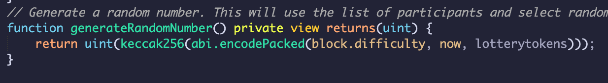

# Blockchain_Lottery

## BACKGROUND 

Lotteries have long sufficed as a way for governments to generate revenue and have act as a symbol of hope for miraculous wealth to the proletariat. Despite these long established efficiencies, blockchain integrated lotteries would be an overall superior experience. Most physical things have proven to be more efficient and secure when digitized, such as wallets. The lottery would be just the most recent example of this well-established trend. Although online lotteries do exist, leveraging blockchain in lotteries side steps potential downfalls of the physical lottery even more so than typical online variations.

Some issues with brand name lotteries, such as *Mega Millions* or the *Powerball*, are that there have been multiple instances of inside jobs manipulating the winning numbers or dates. One of the most infamous examples of this nefarious behavior came when notorious Boston mobster Whitey Bulger allegedly rigged the lottery in Massachusetts to the betterment of himself and his associates. 

Another issue lies in the overall cost of maintaining these “brick-and-mortar” lottery machines, so to speak. There are staffing costs associated with maintaining the servers, maintaining the tickets, packaging, distribution and commission to be paid to gas stations where tickets are sold. The television draws and radios/online ads that must be held to announce winning numbers and promote new games add another layer of expenses. 

Beyond the cost, there are also transparency and physical security concerns. A number of states do not allow winners to conceal their identities. While this helps alleviate the potential for outright collusion and conspiracy, it does put a huge target on a person’s back by friends, family, or even strangers that previously did not have any relationship with the winner. Interestingly enough, according to the Nation Conference of State Legislatures Arizona, Delaware, Georgia, Kansas, Maryland, Michigan, Texas, North Dakota, and Ohio winners are allowed to conceal their identities if their winnings exceed a certain dollar amount. 

The blockchain framework improves the overall product of a lottery by a considerable amount. Trust and fairness is a crucial aspect of any game. Why would anyone participate in a game that wasn’t fair? Since all of the information is stored in “blocks” and collectively verified, the lottery can never lose its integrity or be manipulated. Also, making the lottery tickets completely digital and non-fungible eliminates the possibility of forging a winning ticket, which has become a common threat to traditional lotteries. The essence of the blockchain network inherently establishes an impenetrable environment of trust that players can put their faith in. This trust can be enhanced by allowing for "open sourcing" of the contract code, where players can audit the flow of the contract and even participant in changes and improvements to the contract. The payment methods become more efficient as well, for everything is conducted through virtual wallets and tokens. Although oversized checks are a staple of lotteries, digital payments are more efficient in nature. Additionally, the adaptability of the contracts allows for more creativity when structuring the lottery system which will be covered more in depth later on in this analysis.

Blockchain also has the potential to create a completely borderless lottery, that is not run by state or federal governments, but rather is facilitated by a decentralized collection of computer nodes. 

Of course, it is important to note, that these blockchain improvements are only as good as the underlying contracts. There is still potential for fraud from the contract owners and cheating from hackers. Additionally, there is a concern of waste through gas consumption. These and other issues need to be addressed to a satisfactory degree the contract. 
___

## ECONOMICS OF THE LOTTERY

The lottery may seem like a luck of the draw game for major prize money, but historically it has been used to stimulate economies. For instance, the financiers of Jamestown, Virginia used lotteries to help raise money to support their colony. Not long after, each of the 13 original colonies established a lottery system to raise revenue. In the 17th and 18th centuries, the colonies and states of the Americas used lotteries to fund libraries, churches and institutions of higher education. The American Revolution was also partly funded by lotteries. 

Today, the lottery generates about 72 billion dollars in revenue. Every state varies with their use of the funds. Over $900 million dollars generated by the Pennsylvania Lottery has been used for programs for the elderly including free transportation, rent rebates, care services, and more. Another example includes Minnesota putting about a quarter of its lottery revenue into an Environment and Natural Resources Trust Fund, which ensures water quality, protecting native fish and animals, regulating septic pollution, and many other important environmental initiatives. In conclusion, the lottery and its benefits to the financing of society is a long established tradition. Bringing this archaic game to the blockchain unlocks new and innovative ways for governments and private institutions to raises funds and gives consumers new ways to find winnings.
____

## CONTRACT DESCRIPTIONS

### Token Contract
To begin, in our code we wrote a contract in solidity to create a Non-Fungible Token ("NFT") to serve as our lottery ticket. The reason that we used the ERC721 standard from OpenZepplin rather than the ERC20 standard for fungible tokens was because we needed a way to chart a specific token to a specific address in order to declare a winner. While the ERC20 standard is easier to use in a *crowdsale* situation, like you would expect to have during a lottery, there is no built in functionality to check which address owns which specific token. There is only the ability to check the balance of the addresses. So, while in the real world it is natural to think of lottery tickets as fungible in that they are interchangeable due to their equal likelihood of winning, in solidity we really need to leverage NFTs.

### Market Contract
After our token contract, we then needed to create a contract that would allow participants to come to our lottery and purchase our tokens unsolicited in a market place rather than simply awarding tokens to addresses, as is the standard in the OpenZepplin ERC721 solidity file. To begin, we needed to create two arrays, each of which would capture the addresses of our participants and the tokens that have been minted and purchased.

Next, we had to create a structure to account for our participant's addresses and their names. We also had to create mapping that would link the token ids to the participant structure and their address. Each of these objects helps us keep track of our players and their information. Each are dynamically updated as players buy new tokens through our purchase function below.

We also have active and deactivate functions within the contract to ensure that no unauthorized users can start the lottery and only “the house” can start a new session. This serves as a safeguard against an unauthorized persons seeking to game the system. 

### Selecting random winner and distributing funds:
Finally, we needed to create functionality in our market place contract to declare a winner and distribute the funds. To begin, we need to create, as described above, an array of tokens that would would store the token ids as they are minted. In the end, this array would be a list of 1, 2, 3, 4 up to the last token number that we sold. 

Next, we had to create a function to generate a random number. As you can see, we needed to source some randomness using the "block.difficulty, now" code. We then needed to compute a hash of this, which we could then cast into an integer, which will later be forced into a range. It is important to note that this is not entirely safe, as miners do have the ability to influence **now**, and thus have the ability to influence our code.

To close, we can declare a winner by calling the generate random function and feeding the length, or the number of tokens, in the token array. The random index selected would correspond perfectly to the token id number and this id would be used in the mapping describer earlier to find the winning address.

____

## DEPLOYMENT DEMONSTRATION & INSTRUCTIONS

After the code has been written, we can proceed with the deployment and running of the lottery. 

1) First, we will compile and deploy the LotteryToken.sol solidity file. This will set up our actual token using the ERC721 standard. When the MetaMask notification pops up, please hit 'Confirm' to continue. 

2) Next, we can deploy the LotteryTokenMarket.sol solidity file. This file and contract will allow wallet address to enter our contract unsolicited and purchase our NFT tokens in order to be apart of the lottery. 

To deploy, you will have to provide a price for the NFTs and a token address. For a token address, please copy the address from the previously deployed LotteryToken contract. Again, when the MetaMask notification appears, select 'Confirm' to continue.

3) Once we have deployed both contracts, we will want to activate the lottery through the LotteryTokenMarket contract. In our code, we have create a boolean to declare whether or not the lottery is active. In order for participants to purchase tokens, we will need to activate the lottery.

4) Once the lottery has been activate, participants will be allowed to begin purchasing their tokens. When they purchase, they will have to enter their wallet address and their names. These attributes will be added to *struct* and *mapping* objects so that we can keep track of the participant's information and declare a winner at the end. 

In this demonstration, I will be using two address from my Ganache and will name them 'Bill' and 'Carl'. In order to purchase, you will need to insert 1 in the value field above the deployed contracts

5) After our participants have purchased their tokens, which will serve as their lottery tickets, there are some things we can do to verify that our contract is working correctly. First, we can select **get_pot_balance** in the LotteryTokenMarket contract to ensure that the balance of the contract has gone up in relation to the purchases of tokens (should be 2). Secondly, select **participant_information** and feed in either 1 or 2 to make sure that we are properly keeping track of the participants and their address. Third, we can do the same with the **tokendict** object, as we will be using this mapping to award the balance to the winner. 

We can do a similar exercise in the LotteryToken contract. By call the **totalSupply** option, we can verify that the supply has increased from 0 to 2. We can also feed in our tokenIds (1, 2, 3, 4...) to the **owner** field to return the address that owns that particular token. 

6) After we have verified that we believe the contracts are working properly in relation to our transactions, we can deactivate our lottery. This will close out our lottery, forbid any further purchases, and allow us to proceed with selecting a winner. The deactivate functionality is located in the LotteryTokenMarket contract.

7) With the lottery shutdown, we can select a winner. We can do so by selecting the **declare_winner** button in the LotteryTokenMarket contract. In the code, this will select a random number, using the number of index in the lotteryTokens array. Each index corresponds to a token, and since the tokenIds and indexes increase incrementally by one, the first index will correspond to tokenId 1 and the second index will correspond to tokenId 2. 

The declare_winner function will also distribute the funds to the winner by using the winning index (i.e. tokenId) and feeding into the tokendict mapping to select the winning address.

8) Once we have called this function, we will want to verify that it has properly selected a winner and distributed the funds. To begin, we can check that one of our Ganache address went up by 2 ETH. In this case, each address was 100, so it should be easy to verify.

We can also call **get_pot_balance** again to verify that the contract balance was reduced to 0. Additionally, we can call **getWinner** to get the name of the participant who won. In this case, the winner was Bill and his Ganache address reflects a proper distribution of the winnings.

___

## FUTURE APPLICATIONS

While this project serves as a demonstration for the potential of the decentralized lottery on the blockchain, there are still even more unique applications for what we have begun here and directions we would have liked to gone had we had a year to develop our code. First, state governments looking to improve upon security and efficiency could leverage these technologies to help administer their games. As discussed previously, the winner in a blockchain lottery is immediately sent the winnings, which is far easier than needing a ticket holder to come forward. And while it is hard at this moment to envision the Commonwealth of Massachusetts or Virginia turning to Bitcoin or Ethereum to help facilitate their municipal duties, the first Big Four consulting firm, PwC, just accepted their first cryptocurrency payment, demonstrating that even the oldest and most conservative firms have the ability to adapt to the times. 

There is also no reason that the lottery has to be a "winner take all" game. A no-loss system where the lottery pot is invested in interest bearing accounts or assets and the yield is then used as a recurring winning is quite possible using crypto wallets and blockchain technologies. Take, for instance, the popular decentralized application *PoolTogether*, which seeks to "gamify" the way people save their money. Owning a PoolTogether token gives you claim over a portion of a pool of cryptocurrency, which is invested into interest bearing accounts using another Defi application, *Compound.Yield*. The interest garnered from this investment, is used to pay a winning token address on a regular cadence, which also preserves the initial value of the pool. 

For our purposes, we could code an option for the house to take a portion of the winning pot and send the rest to the winner, mirroring the way state lottery system take a portion of the winnings through an initial taxation. We could also create a tier based winning system, where the pot is split unevenly between the first, second and third place winner. 

The possibilities of where a Blockchain Lottery system can go are really endless. There are different concepts out there already but since it is a newer idea, the programmers imagination can be used to build this system to be really complex on the backend, yet straightforward for the user to access and play the odds to win the jackpot in a new and exciting way. 